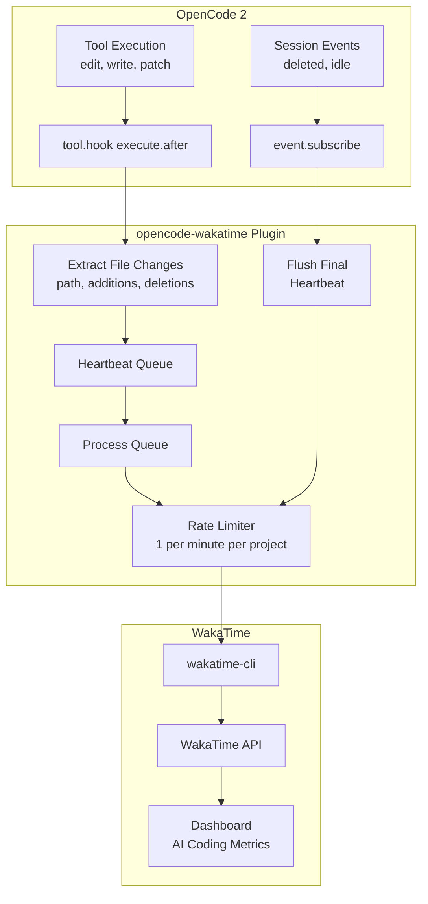

# opencode-wakatime

[](https://www.npmjs.com/package/opencode-wakatime)
[](https://www.npmjs.com/package/opencode-wakatime)
[](https://github.com/angristan/opencode-wakatime/actions/workflows/workflow.yml)
[](LICENSE)

WakaTime plugin for [OpenCode](https://github.com/sst/opencode) - Track your AI coding activity, lines of code, and time spent.

Works with OpenCode 2 using the V2 plugin API (`@opencode-ai/plugin`).

> OpenCode 2 is the current generation of OpenCode. This plugin targets the OpenCode 2 plugin API.

> [!TIP]
> Also check out [codex-wakatime](https://github.com/angristan/codex-wakatime) for OpenAI Codex CLI!

## Features

- **Automatic CLI management** - Downloads and updates wakatime-cli automatically
- **Detailed file tracking** - Tracks file modifications (edit, patch, write)
- **AI coding metrics** - Sends `--ai-line-changes` for WakaTime AI coding analytics
- **Rate-limited heartbeats** - 1 per minute per project to avoid API spam
- **Session lifecycle** - Sends final heartbeat on session idle/end

## Prerequisites

### WakaTime API Key

Ensure you have a WakaTime API key configured in `~/.wakatime.cfg`
(or `$WAKATIME_HOME/.wakatime.cfg` when `WAKATIME_HOME` is set):

```ini
[settings]
api_key = waka_your_api_key_here
```

You can get your API key from [WakaTime Settings](https://wakatime.com/api-key).

### WakaTime CLI (Optional)

In case of manual install, the plugin will automatically download wakatime-cli if not found. However, you can also install it yourself:

**macOS:**

```bash
brew install wakatime-cli
```

**Other platforms:**
Download from [WakaTime releases](https://github.com/wakatime/wakatime-cli/releases/latest).

## Installation

### Via opencode config (recommended)

opencode.json:

```json
{
  "$schema": "https://opencode.ai/config.json",
  "plugins": ["opencode-wakatime"]
}
```

> OpenCode 2 uses the `plugins` key (OpenCode 1 used `plugin`).

### Manually via npm

```bash
npm i -g opencode-wakatime
opencode-wakatime --install
```

> This installs the plugin to `~/.config/opencode/plugin/wakatime.js`.
>
> OpenCode 2 also discovers local plugins under `~/.config/opencode/plugins/` — you can copy the built `dist/bundle.js` there instead.

To update, run the same commands again.

### From source

```bash
git clone https://github.com/angristan/opencode-wakatime
cd opencode-wakatime
npm install && npm run build
node bin/cli.js --install
```

The plugin will be automatically loaded by OpenCode - no configuration needed.

## How It Works

The plugin hooks into OpenCode 2's plugin API. It registers a tool hook to collect file changes and subscribes to session lifecycle events:



### Hooks Used

| Hook                                                              | Purpose                                             |
| ----------------------------------------------------------------- | --------------------------------------------------- |
| `tool.hook("execute.after")`                                      | Tracks completed tool executions to collect file changes |
| `event.subscribe` (`session.deleted` / `session.idle`)            | Sends a final heartbeat on session lifecycle events |

### Tool Tracking

| Tool   | Data Extracted                                      |
| ------ | --------------------------------------------------- |
| `edit` | File path, additions, deletions (from `files`/`FileDiff`) |
| `patch` | File paths and changes (from `files`/`FileDiff`)    |
| `write` | File path, new file detection (from tool output)    |

Reads and search/shell tools are not tracked because they do not carry reliable file-change information.

### Heartbeat Data

Each heartbeat includes:

- **Entity**: File path being worked on
- **Project folder**: Working directory
- **AI line changes**: Net lines added/removed (`additions - deletions`)
- **Category**: "ai coding"
- **Plugin identifier**: `opencode-<client>/<version> opencode-wakatime/<version>` (e.g. `opencode-desktop/1.1.53 opencode-wakatime/1.1.4`)

## Files

By default, plugin files are stored in `~/.wakatime/`.
When `WAKATIME_HOME` is set, the same files are stored in `$WAKATIME_HOME/`.

| File                        | Purpose                                    |
| --------------------------- | ------------------------------------------ |
| `opencode.log`              | Debug logs (enabled via `debug=true` in `~/.wakatime.cfg`) |
| `opencode-{hash}.json`      | Per-project state (last heartbeat timestamp) |
| `opencode-cli-state.json`   | CLI version tracking                       |
| `wakatime-cli-*`            | Auto-downloaded CLI binary                 |

## Development

```bash
# Install dependencies
npm install

# Type check
npm run typecheck

# Build
npm run build
```

## Troubleshooting

### Plugin not loading

1. Check your config file syntax (`opencode.jsonc`)
2. Verify the plugin path is correct
3. Check logs at `~/.wakatime/opencode.log`

### Heartbeats not sending

1. Verify API key in `~/.wakatime.cfg`
2. Check if wakatime-cli is working: `wakatime-cli --version`
3. Enable debug logging and check `~/.wakatime/opencode.log`
   (or `$WAKATIME_HOME/opencode.log` when set)

### CLI not downloading

1. Check network connectivity
2. Verify write permissions to `~/.wakatime/`
   (or `$WAKATIME_HOME/` when set)
3. Manually install: `brew install wakatime-cli`

## License

MIT
