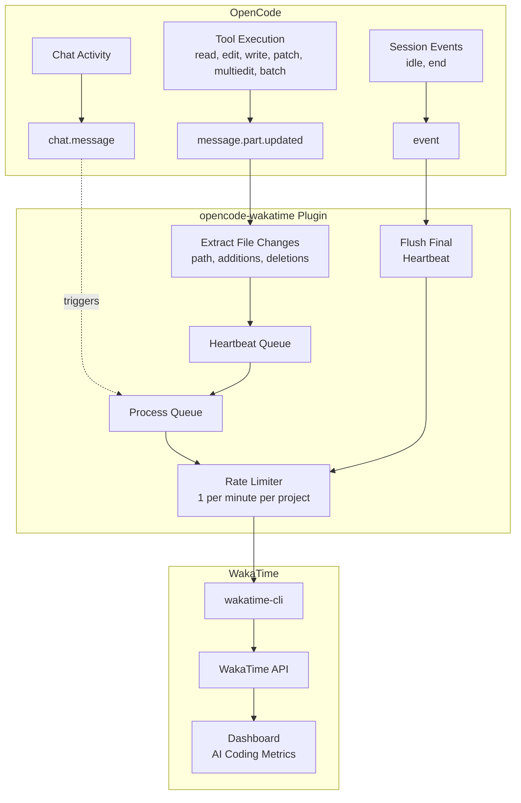

# opencode-wakatime

[](https://www.npmjs.com/package/opencode-wakatime)
[](https://www.npmjs.com/package/opencode-wakatime)
[](https://github.com/angristan/opencode-wakatime/actions/workflows/workflow.yml)
[](LICENSE)

WakaTime plugin for [OpenCode](https://github.com/anomalyco/opencode) v1 and v2. Track your AI coding activity, lines of code, and time spent with the same npm package.

Inspired by [claude-code-wakatime](https://github.com/wakatime/claude-code-wakatime).

> [!TIP]
> Also check out [codex-wakatime](https://github.com/angristan/codex-wakatime) for OpenAI Codex CLI!

## Features

- **Automatic CLI management** - Downloads and updates wakatime-cli automatically
- **Detailed file tracking** - Tracks file reads and modifications (edit, write, patch, multiedit)
- **AI coding metrics** - Sends `--ai-line-changes` for WakaTime AI coding analytics
- **Rate-limited heartbeats** - 1 per minute per project to avoid API spam
- **Session lifecycle** - Sends final heartbeat on session idle/end
- **Batch tool support** - Tracks file operations executed via batch tool

## Prerequisites

### WakaTime API Key

Ensure you have a WakaTime API key configured in `~/.wakatime.cfg`
(or `$WAKATIME_HOME/.wakatime.cfg` when `WAKATIME_HOME` is set):

```ini
[settings]
api_key = waka_your_api_key_here
```

You can get your API key from [WakaTime Settings](https://wakatime.com/api-key).

### WakaTime CLI (Optional)

In case of manual install, the plugin will automatically download wakatime-cli if not found. However, you can also install it yourself:

**macOS:**

```bash
brew install wakatime-cli
```

**Other platforms:**
Download from [WakaTime releases](https://github.com/wakatime/wakatime-cli/releases/latest).

## Installation

### Via opencode config (recommended)

Shared config for OpenCode v1 and v2 (`opencode.json`):

```json
{
  "$schema": "https://opencode.ai/config.json",
  "plugin": ["opencode-wakatime"]
}
```

V2 also accepts its native `plugins` key:

```json
{
  "plugins": ["opencode-wakatime"]
}
```

V2 accepts and normalizes the legacy `plugin` key, so the first example works
with both versions. Use the same package version for both. Older v1 releases load the legacy
entrypoint. Recent v1 releases and v2 load the `./server` entrypoint, which
provides both implementations.

V2 support targets the Promise plugin API in `@opencode/plugin` 2.0.18.
The v2 API is still changing; older v2 previews may use different contracts.
The plugin does not load either OpenCode SDK at runtime.

### Via the npm installer

```bash
npm i -g opencode-wakatime
opencode-wakatime --install
```

The same command works for v1 and v2. It registers `opencode-wakatime` in the
global OpenCode config instead of copying a standalone plugin. OpenCode loads
the package from npm and selects the entrypoint for its API when it starts.

The installer:

- Uses `$XDG_CONFIG_HOME/opencode/`, or `~/.config/opencode/` by default.
- Edits an existing `opencode.jsonc`, `opencode.json`, or legacy `config.json`,
  preferring that order. If none exists, it creates `opencode.json` with `plugin`.
- Preserves comments, unrelated settings, existing version pins, and plugin options.
  If a config already uses `plugins`, it keeps that key.
- Keeps one WakaTime registration across these global configs. Running it again
  does not add another entry.
- Removes recognized old `plugin/wakatime.js` and `plugins/wakatime.js` bundles
  after saving the config. Unrecognized files are left untouched and reported.

Restart OpenCode after installation. This command changes only global config;
it does not edit project configs or files selected through `OPENCODE_CONFIG`
or `OPENCODE_CONFIG_DIR`. Remove any separate project-level WakaTime installation
to avoid duplicate tracking.

To remove the global registration and old bundles:

```bash
opencode-wakatime --uninstall
```

Uninstalling preserves other plugins and settings. To remove the installer too,
run `npm uninstall -g opencode-wakatime`.

### Build from source

```bash
git clone https://github.com/angristan/opencode-wakatime
cd opencode-wakatime
npm install && npm run build
npm run test:run
```

The installer always registers the published npm package, not the source checkout.

## How It Works

Both adapters feed a shared heartbeat queue. The following diagram shows the v1 hooks:


```mermaid
flowchart TB
    subgraph OpenCode["OpenCode"]
        A[Tool Execution<br/>read, edit, write, patch, multiedit, batch] --> H1[message.part.updated]
        B[Chat Activity] --> H2[chat.message]
        C[Session Events<br/>idle, end] --> H3[event]
    end

    subgraph Plugin["opencode-wakatime Plugin"]
        H1 --> P1[Extract File Changes<br/>path, additions, deletions]
        P1 --> Q[Heartbeat Queue]

        H2 -.->|triggers| P2[Process Queue]
        Q --> P2
        P2 --> R[Rate Limiter<br/>1 per minute per project]

        H3 --> P3[Flush Final<br/>Heartbeat]
        P3 --> R
    end

    subgraph WakaTime["WakaTime"]
        R --> CLI[wakatime-cli]
        CLI --> API[WakaTime API]
        API --> D[Dashboard<br/>AI Coding Metrics]
    end

```

### Hooks Used

| Activity | V1 | V2 |
| --- | --- | --- |
| Tool completion | `event` → `message.part.updated` | `ctx.tool.hook("execute.after", ...)` |
| Chat activity | `chat.message` | `ctx.session.hook("prompt", ...)` |
| Idle/end | `session.idle`, `session.deleted` | `ctx.event.subscribe()` → idle `session.status`, `session.deleted` |
| Unload | `dispose` on v1 releases that support it | Cleanup returned by `setup` |

V2 ignores failed tool calls, filters activity by location, and stops its event
subscription on unload. Both adapters flush queued heartbeats on idle/end.
Tracking state and rate limits are scoped to each project.

### Tool Tracking

| Tool | V1 | V2 |
| --- | --- | --- |
| `read` | File path from title | File path from input; directory listings excluded |
| `edit` | `filediff` metadata | Structured `files` diffs |
| `write` | File path and new-file detection | Structured `target` and `existed` result |
| `patch` | Paths from output and approximate diff count | Structured `files` diffs |
| `multiedit` | Per-edit `filediff` metadata | Not a built-in v2 tool |
| `batch` | Child tool completion events | Tracks child operations when they emit tool hooks |

Write results do not supply line counts, so writes track file activity without
estimating AI line changes.

### Heartbeat Data

Each heartbeat includes:

- **Entity**: File path being worked on
- **Project folder**: Working directory
- **AI line changes**: Net lines added/removed (`additions - deletions`)
- **Category**: "ai coding"
- **Plugin identifier**: `opencode-<client>/<version> opencode-wakatime/<version>` (e.g. `opencode-desktop/1.1.53 opencode-wakatime/1.1.4`)

## Files

By default, plugin files are stored in `~/.wakatime/`.
When `WAKATIME_HOME` is set, the same files are stored in `$WAKATIME_HOME/`.

| File                        | Purpose                                    |
| --------------------------- | ------------------------------------------ |
| `opencode.log`              | Debug logs (enabled via `debug=true` in `~/.wakatime.cfg`) |
| `opencode-{hash}.json`      | Per-project state (last heartbeat timestamp) |
| `opencode-cli-state.json`   | CLI version tracking                       |
| `opencode-version-cache.json` | Cached OpenCode server version             |
| `wakatime-cli-*`            | Auto-downloaded CLI binary                 |

## Development

```bash
# Install dependencies
npm install

# Type check
npm run typecheck

# Build both npm entrypoints and standalone bundles
npm run build

# Run tests
npm run test:run
```

The package root exports only the legacy v1 plugin function. `./server` exports
an object with v1 `server` and v2 `setup` functions. Keep helpers out of these
entrypoints: older v1 loaders invoke every export as a plugin.

`src/v2-api.ts` describes the small structural API used by the v2 adapter and
records the upstream revision. Update its contract tests when adopting a new
v2 API. Packaging tests check both entrypoints and standalone bundles without
an installed OpenCode SDK; they do not replace smoke tests in OpenCode itself.

## Troubleshooting

### Plugin not loading

1. Check your config file syntax (`opencode.jsonc`)
2. Verify the plugin path is correct
3. Check logs at `~/.wakatime/opencode.log`

### Heartbeats not sending

1. Verify API key in `~/.wakatime.cfg`
2. Check if wakatime-cli is working: `wakatime-cli --version`
3. Enable debug logging and check `~/.wakatime/opencode.log`
   (or `$WAKATIME_HOME/opencode.log` when set)

### CLI not downloading

1. Check network connectivity
2. Verify write permissions to `~/.wakatime/`
   (or `$WAKATIME_HOME/` when set)
3. Manually install: `brew install wakatime-cli`

## License

MIT
